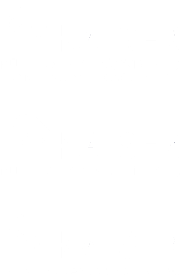
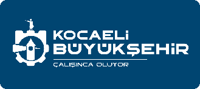

Kocaeli Geneli Yaya Ulaşım Stratejilerinin Geliştirilmesi ve 

Eylem Planı Danışmanlık Hizmet Alımı İşi

__KOCAELİ YAYA ULAŞIM EYLEM PLANI__

__Hackathon Metodoloji Raporu__

TASLAK

İÇİNDEKİLER

[İÇİNDEKİLER	i](#_Toc222307683)

[GİRİŞ	0](#_Toc222307684)

[Amaç ve Kapsam	0](#_Toc222307685)

[1\.	HAZIRLIK AŞAMASI	1](#_Toc222307686)

[1\.1\.	Ön Hazırlık Aşaması	1](#_Toc222307687)

[1\.1\.1\.	Teknik ve İçerik Hazırlığı	1](#_Toc222307688)

[1\.1\.2\.	Katılımcı Kayıt Platformunun Oluşturulması	1](#_Toc222307689)

[1\.1\.3\.	Katılımcı Profilinin Belirlenmesi	2](#_Toc222307690)

[1\.1\.4\.	Jürinin Belirlenmesi	3](#_Toc222307691)

[1\.1\.5\.	Mekanın Belirlenmesi	3](#_Toc222307692)

[2\.	ÇALIŞMA PRENSİPLERİ	4](#_Toc222307693)

[2\.1\.	Tasarım Yaklaşımları	4](#_Toc222307694)

[2\.1\.1\.	Tasarım Odaklı Düşünce \(Design Thinking\) Temelli Yaklaşım	4](#_Toc222307695)

[2\.1\.2\.	Taktiksel Şehircilik \(Tactical Urbanism\) Yaklaşımı	5](#_Toc222307696)

[2\.1\.3\.	3\. Dijital ve Fiziksel Entegrasyon	5](#_Toc222307697)

[2\.2\.	Tasarım Sorusu Çerçevesi	5](#_Toc222307698)

[3\.	ETKİNLİK TAKVİMİ ve PROGRAM	7](#_Toc222307699)

[3\.1\.	Saha Keşif Programı \- 5 Haziran 2026	7](#_Toc222307700)

[3\.2\.	Hackathon Günü Programı \- 6 Haziran 2026	7](#_Toc222307701)

[4\.	MEKÂNSAL ORGANİZASYON ve EKİPMAN	8](#_Toc222307702)

GİRİŞ

Kocaeli Yaya Ulaşımı Eylem Planı, kentte yaya hareketliliğinin güvenli, erişilebilir, kapsayıcı ve sürdürülebilir bir yapıya kavuşturulmasını amaçlayan stratejik bir planlama çalışmasıdır\. Plan kapsamında, özellikle alt merkezlerde yaya deneyiminin güçlendirilmesi, kamusal alan kalitesinin artırılması ve yaya öncelikli tasarım yaklaşımlarının geliştirilmesi hedeflenmektedir\.

Kentsel ulaşım planlamasında yenilikçi, katılımcı ve çok aktörlü süreçlerin önemi giderek artmaktadır\. 

Bu doğrultuda, gençlerin ve üniversite öğrencilerinin yaratıcı potansiyelini sürece dahil etmek için 6 Haziran 2026 tarihinde 12 saatlik yoğunlaştırılmış bir Hackathon etkinliği düzenlenecektir\.

Bu etkinlik; belirlenen iki alt merkez için yaya odaklı mekânsal ve işlevsel iyileştirme fikirlerinin geliştirilmesini, yenilikçi tasarım önerilerinin ortaya konmasını ve uygulanabilir proje fikirlerinin üretilmesini amaçlamaktadır\. Katılımcılar; kent içi erişilebilirlik, güvenlik, kamusal alan kalitesi, yaya\-toplu taşıma entegrasyonu ve iklim duyarlı tasarım başlıkları çerçevesinde çözüm önerileri geliştireceklerdir\.

Hackathon formatı, kısa sürede disiplinler arası ekip çalışmasını teşvik eden, problem odaklı ve sonuç üretmeye yönelik bir yöntemdir\. Bu yaklaşım sayesinde, gençlerin kent mekânına dair eleştirel bakış açıları ve yaratıcı çözüm önerileri Yaya Ulaşımı Eylem Planı’nın uygulama aşamasına katkı sağlayacaktır\.

Etkinlik sonunda geliştirilen proje fikirleri değerlendirilerek, teknik, fizibilite ve uygulanabilirlik kriterleri doğrultusunda eylem planı öneri havuzuna dahil edilecektir\.

Amaç ve Kapsam

Kocaeli Yaya Ulaşımı Eylem Planı kapsamında düzenlenecek Hackathon etkinliğinin amacı; belirlenen iki alt merkez için yaya öncelikli, güvenli, erişilebilir ve yenilikçi tasarım ve uygulama önerilerinin üniversite öğrencileri tarafından geliştirilmesini sağlamaktır\.

Etkinlik ile gençlerin yaratıcı potansiyelinin planlama sürecine entegre edilmesi ve katılımcı, disiplinler arası bir fikir üretim ortamının oluşturulması hedeflenmektedir\. Beklenen çıktılar aşağıda verilmektedir: 

- İki alt merkez için yaya odaklı sorun alanlarının analiz edilmesi
- Kısa, orta ve uzun vadeli müdahale önerilerinin geliştirilmesi
- Mekânsal tasarım \+ politika \+ uygulama araçlarını birlikte ele alan bütüncül fikirlerin üretilmesi
- Yaya güvenliği, erişilebilirlik ve kamusal alan kalitesi başlıklarında yenilikçi çözümler geliştirilmesi
- Yerel planlama süreçlerine aktif katılımının sağlanması
- Eylem planı için proje fikir havuzu oluşturulması 

1. HAZIRLIK AŞAMASI 

6 Haziran 2026 tarihinde gerçekleştirilecek olan programa katılımcı kayıtlarının en az 3 ay önce açılması gerekmekte, tüm hazırlıkların ise etkinlik takviminden en az 2 ay önce tamamlanması hedeflenmaktedir\. 

Amaç ve Kapsam Netleştirme:

__Etkinliğin Ana Hedefi:__ "İzmit ve Darıca için güvenli, erişilebilir, yaşanabilir ve sürdürülebilir yaya bölgeleri tasarlamak\."

__Beklenen Somut Çıktı__: Fizibilite etüdü, kavramsal tasarım, prototip veya dijital çözüm önerileri\.

- 
	1. Ön Hazırlık Aşaması 

Hackathon etkinliğinin verimli, adil ve sonuç üretmeye yönelik bir yapıda gerçekleştirilebilmesi için etkinlik öncesi hazırlık süreci sistematik bir şekilde yürütülecektir\. Bu aşama, içerik hazırlığı, katılımcı seçimi, organizasyonel yapı ve değerlendirme çerçevesinin oluşturulmasını kapsamaktadır\.

- 
	- 
		1. Teknik ve İçerik Hazırlığı

Belirlenen iki alt merkeze ilişkin mevcut analizlerin \(yaya yoğunluğu, erişilebilirlik, güvenlik sorunları, kamusal alan kullanımı vb\.\) hazırlanması ile katılımcıların zamanlarını veri toplamak yerine çözüm geliştirmeye odaklayabilmelerini sağlamayı amaçlamaktadır\. Hazırlanacak veri setleri: 

- Güncel hava fotoğrafları ve plan kararlarının derlenmesi
- Mevcut sorun alanlarının teknik rapor üzerinden özetlenmesi
- Katılımcıların kolay anlayabileceği şekilde veri setlerinin sadeleştirilmesi
	- İlçe alt merkezlerinin mevcut durum haritaları, trafik verileri, nüfus yoğunluğu\.
	- Kentsel tasarım ilkeleri, yaya odaklı şehircilik \(tactical urbanism\) örnekleri\.
	- Yasal ve idari kısıtlamaların özeti\.
- Problem tanım dokümanının hazırlanması \(tasarım sorusu çerçevesi\)
	- 
		1. Katılımcı Kayıt Platformunun Oluşturulması

Etkinlik için çevrim içi bir başvuru ve kayıt platformu oluşturulacaktır\. Platform aşağıdaki unsurları içerecektir:

- Etkinlik amacı ve kapsamı
- Alt merkezlere ilişkin kısa bilgilendirme
- Katılım koşulları
- Değerlendirme süreci
- Başvuru takvimi

Web üzerinden paylaşılacak başvuru formunda aşağıdaki bilgiler talep edilecektir:

- __Kişisel Bilgiler__: Ad, iletişim, meslek/öğrencilik durumu\.
- __Disiplin/ Uzmanlık Alanı__: Mimarlık, Şehir Planlama, Yazılım Mühendisliği, Sosyoloji, Grafik Tasarım, öğrencileri Sivil Toplum, Yerel Halk/Vatandaş gibi bir dropdown menü\.
- __Deneyim Seviyesi__: Öğrenci, Yeni Mezun, 1\-5 Yıl Deneyim, 5\+ Yıl Deneyim\.
- __Teknik beceriler:__ GIS, çizim programları, analiz araçları vb\.
- __Motivasyon Mektubu__ \(Kısa\): "Neden katılmak istiyorsunuz? İzmit/Darıca için yaya bölgesi konusunda en büyük sorun ne sizce?" \(Bu, katılımcı kalitesini ve tutkusunu ölçmemizi sağlar\)\.
- __Takımda Olmak İstediğiniz__ __Kişi__ \(Opsiyonel\): En fazla 2 kişi ismini yazabilir\. Düzenleyici komite tarafından bu talep mümkünse yerine getirilecektir ancak garantisi yoktur\.

Başvurular belirlenen kriterler doğrultusunda değerlendirilecek ve dengeli ekip dağılımı sağlanacaktır\.

Başvuru Şeklinin Katılımcılara Net Açıklanması Önemlidir\.    

Başvuru şekli etkinliğin başarısını doğrudan etkileyecek önemli karardır\. Başvuru bireysel veya takım halinde gerçekleştirilebilir\. “__Hackathon, disiplinler arası takımlar oluşturmayı hedeflemektedir\. Bireysel başvurular önceliklidir\. Seçilen katılımcılar, organizasyon komitesi tarafından dengeli bir şekilde takımlara ayrılacaktır\.__"

- 
	- 
		1. Katılımcı Profilinin Belirlenmesi 

Hackathon’a katılım aşağıdaki gruplara açık olacaktır:

- Şehir ve Bölge Planlama öğrencileri
- Mimarlık öğrencileri
- İnşaat ve Ulaştırma Mühendisliği öğrencileri
- Endüstriyel Tasarım öğrencileri
- Peyzaj Mimarlığı öğrencileri
- Sosyoloji, Kamu Yönetimi ve ilgili sosyal bilimler bölümleri
- Veri analizi ve yazılım alanında çalışan öğrenciler

Gruplara katılımcılar atanırken, homojen değil; farklı bakış açılarını bir araya getiren dengeli ekipler oluşturmak amaçlanmaktadır\. Bu kapsamda seçim kriterleri:

- Disiplinler arası çeşitlilik
- Cinsiyet dengesi
- Farklı üniversitelerden temsil
- Teknik ve analitik kapasite
- Motivasyon düzeyi
- Takım çalışmasına yatkınlık

Katılımcı Seçimi ve Ekiplerin Oluşturulması Süreci:

- __Katılımcı Sayısı:__ 100 kişi için; 25 mimar, 25 plancı/mühendis, 20 tasarımcı/yazılımcı, 15 sosyal bilimci, 15 yerel halk/öğrenci/diğer\. Bu kotayı başvuru formundaki "uzmanlık alanı" sorusuyla yönetilecektir\.
- __Seçim bir jüri ile yapılmalıdır__\. \(Belediye, Üniversite, Kamu temsilcilerinden oluşabilir\) 5 kişilik jüri
- __Takım Oluşturma Matrisi__: Başvuruda bulunan 100 kişiyi bir tablo ile listeleyip değerlendirme\. \(Disiplin, Deneyim, Motivasyon\)\. Her takımda her disiplinden en az 1 kişi, farklı deneyim seviyeleri ve yüksek motivasyonlu bir "takım kaptanı" olacak şekilde manuel veya yarı\-otomatik takımlar oluşturulması sağlanacaktır\.

Takımlar, yürütücü ekip tarafından önceden belirlenecek ve etkinlik günü duyurulacaktır\.

- 
	- 
		1. Jürinin Belirlenmesi 

Hackathon etkinliğinin jüri yapısı; bilimsel, teknik ve uygulamaya dönük değerlendirme kapasitesini güçlendirmek amacıyla il ve bölge düzeyinde konu ile ilgili uzman akademisyenlerden oluşturulacak, üniversitelerde görev yapan, kentsel hareketlilik, ulaşım sistemleri, kamusal alan tasarımı ve sürdürülebilir kent politikaları alanlarında akademik yayın ve proje deneyimine sahip öğretim üyelerinden seçilecektir\.

Jürinin oluşturulmasında aşağıdaki hususlara dikkat edilecektir:

- Disiplinler arası temsil dengesi
- Akademik kıdem ve saha deneyimi çeşitliliği
- Cinsiyet dengesi
- Yerel bağlamı bilen ancak tarafsız değerlendirme yapabilecek uzman profili
	- 
		1. Mekanın Belirlenmesi 

Etkinliğinin verimli, etkileşimi destekleyen ve kesintisiz çalışma imkânı sunan bir ortamda gerçekleştirilmesi büyük önem taşımaktadır\. Bu doğrultuda, mekân seçiminde hem teknik yeterlilik hem de organizasyonel gereklilikler dikkate alınmıştır\.  

Şartname kapsamında etkinliğin 4 yıldızlı otel standardında bir mekânda gerçekleştirilmesi öngörülmektedir\. Ayrıca mekânın;

- Ulaşım açısından erişilebilir bir konumda olması \(İzmit veya Darıca\),
- Geniş ve esnek kullanım alanına sahip bir salona sahip olması,
- İkram ve dinlenme alanlarının bulunması,
- Takım çalışmasına uygun fiziksel düzenlemeye imkân vermesi gibi kriterleri sağlaması gerekmektedir\.

Bu çerçevede, hem merkezi konumu hem de Kocaeli Büyükşehir Belediyesi tarafından daha önce benzer etkinliklerde kullanılmış olması nedeniyle __Luxor Garden Park Hotel __uygun mekân olarak belirlenmiştir\. Otelin teknik altyapısı ve salon kapasitesi, etkinliğin gerektirdiği çalışma düzenini karşılamaktadır\.

1. ÇALIŞMA PRENSİPLERİ

Kocaeli Yaya Ulaşımı Eylem Planı Hackathonu, katılımcı, yenilikçi ve uygulanabilir çözümler üretmeyi hedefleyen çok katmanlı bir metodolojik çerçeveye dayanmalıdır\. 

Süreç; tasarım odaklı düşünce yaklaşımı, taktiksel şehircilik prensipleri ve dijital–fiziksel entegrasyonu bir arada ele alan bütüncül bir model üzerinden kurgulanmıştır\.

- 
	1. Tasarım Yaklaşımları 
		1. Tasarım Odaklı Düşünce \(Design Thinking\) Temelli Yaklaşım

Hackathon süreci, insan merkezli tasarım anlayışını esas alan beş aşamalı bir model üzerine kurulmuştur:

1\. Empati Kur

Katılımcılar; yayalar, yaşlılar, çocuklar, engelliler, kadınlar, öğrenciler ve esnaf gibi farklı kullanıcı gruplarının ihtiyaçlarını anlamaya odaklanır\. Saha ziyareti bulguları, veri paketleri ve kullanıcı senaryoları bu aşamanın temel girdilerini oluşturur\.

2\. Problemi Tanımla

Elde edilen gözlem ve veriler doğrultusunda temel mekânsal ve işlevsel sorunlar netleştirilir\.  
Örneğin:

- Yetersiz kaldırım genişlikleri
- Güvensiz yaya geçitleri
- Araç–yaya çatışma noktaları
- Erişilebilirlik eksiklikleri
- Kamusal alan sürekliliğinin kopukluğu

Bu aşamada sorunların mekânsal, sosyal ve çevresel boyutları birlikte değerlendirilir\.

3\. Fikir Üret \(Beyin Fırtınası\)

Disiplinler arası ekipler, yaratıcı ve sınırları zorlayan çözüm fikirleri geliştirir\. Nicelikten çok nitelik odaklı, uygulanabilir ve bağlama duyarlı fikirler teşvik edilir\. Tüm ekip üyelerinin eşit katılımı esastır\.

4\. Prototip Oluştur

Geliştirilen fikirler; şema, diyagram, kesit, 3D model, maket, storyboard veya dijital arayüz taslağı gibi araçlarla somutlaştırılır\. Amaç, fikirlerin hızlı ve anlaşılır biçimde test edilebilir hale getirilmesidir\.

5\. Test Et ve Sun

Takımlar çözümlerini mentorlara ve jüriye sunar, geri bildirim alır ve önerilerini refine eder\. Bu aşama öğrenme ve iyileştirme döngüsünü güçlendirir\.

- 
	- 
		1. Taktiksel Şehircilik \(Tactical Urbanism\) Yaklaşımı

Hackathon kapsamında; hızlı uygulanabilir, düşük maliyetli ve esnek müdahaleler teşvik edilmektedir\.

Geçici uygulamalar \(boyama, modüler kent mobilyası, geçici oturma elemanları, pop\-up yaya alanları vb\.\) aracılığıyla kalıcı dönüşümlere zemin hazırlayan çözümler önceliklidir\.

Bu yaklaşım sayesinde:

- Karar öncesi test imkânı sağlanır
- Toplum geri bildirimi erken aşamada alınır
- Kaynak kullanımı optimize edilir
- Riskler minimize edilir
	- 
		1. 3\. Dijital ve Fiziksel Entegrasyon

Yaya hareketliliği yalnızca fiziksel düzenlemelerle sınırlı görülmemektedir\. Akıllı şehir perspektifi doğrultusunda:

- Sensörlü akıllı yaya geçitleri
- Mobil uygulama destekli yönlendirme sistemleri
- Oyunlaştırılmış yürüyüş rotaları
- Veri tabanlı yaya yoğunluk analizi
- Dijital bilgilendirme ve güvenlik entegrasyonları gibi çözümler de değerlendirme kapsamındadır\.

Amaç; fiziksel mekân kalitesini artırırken dijital araçlarla kullanıcı deneyimini güçlendirmektir\.

- 
	1. Tasarım Sorusu Çerçevesi

__“Bu Kentte Yürümek Nasıl Bir Deneyim?”__

__Bir kenti gerçekten tanımak istiyorsanız, o kentte yürüyün\. __Kocaeli’nde her gün binlerce insan okula, işe, toplu taşımaya, çarşıya yürüyerek ulaşıyor\. Ancak bu yürüyüş herkes için aynı deneyim değil\. 

- __Bir çocuk için karşıdan karşıya geçmek bir risk olabilir\.__
- __Bir yaşlı için bozuk kaldırım bir engel olabilir\.__
- __Dezavantajlı bir birey için bir rampa eksikliği tüm kenti erişilemez kılabilir\.__

Bu Hackathon’da sizden beklenen şey bir sokak tasarlamak değil\. __Bir yaya deneyimi tasarlamanız\.__

Düşünmesi İstenen Sorular:

Sokakları araçlardan geri almanın yolu nedir?

Yaya güvenliği nasıl görünür hale getirilebilir?

Küçük müdahalelerle büyük dönüşüm mümkün mü?

Kamusal alanlar sadece geçiş alanı olmaktan nasıl çıkar?

Bir merkez, 10 yıl sonra nasıl bir yaya mekânına dönüşebilir?

Beklenen:

Sorunu net tanımlayın\.

Bir kullanıcı hikâyesi oluşturun\.

Cesur ama uygulanabilir olun\.

Küçük ama etkili müdahaleler düşünün\.

Mekânı dönüştürürken deneyimi dönüştürün\.

__Stratejik Çerçeve__

Kocaeli’nin alt merkezleri, kent yaşamının yoğunlaştığı; ticaret, eğitim, toplu taşıma ve kamusal etkileşimin kesiştiği alanlardır\. Ancak mevcut durumda bu merkezlerin önemli bir bölümü taşıt öncelikli bir ulaşım yaklaşımı ile şekillenmiştir\.

Yaya hareketliliği çoğu zaman ikinci planda kalmakta; güvenlik, erişilebilirlik ve kamusal alan kalitesi açısından yapısal sorunlar ortaya çıkmaktadır\.

Kocaeli Yaya Ulaşımı Eylem Planı, bu yaklaşımı tersine çevirerek yaya öncelikli, kapsayıcı ve sürdürülebilir bir kentsel hareketlilik modeli geliştirmeyi hedeflemektedir\.

Takımların tasarım sürecinde aşağıdaki sorulara cevap üretmeleri beklenmektedir:

__A\- Mekânsal Boyut__

Yaya sürekliliği nasıl sağlanır?

Kritik kavşak ve geçit noktaları nasıl güvenli hale getirilir?

Sokaklar çok işlevli kamusal alanlara nasıl dönüşür?

__B\- Sosyal ve Kapsayıcı Boyut__

Çocuklar, yaşlılar ve engelliler için erişilebilirlik nasıl garanti altına alınır?

Kadınların gece kullanım güvenliği nasıl artırılır?

Mekân sosyal etkileşimi nasıl teşvik eder?

__C\- Operasyonel ve Yönetimsel Boyut__

Müdahale hangi kurumlar tarafından uygulanabilir?

Kısa vadede düşük maliyetli hangi çözümler hayata geçirilebilir?

Orta ve uzun vadede kalıcı dönüşüm nasıl planlanır?

1. ETKİNLİK TAKVİMİ ve PROGRAM
	1. Saha Keşif Programı \- 5 Haziran 2026

Etkinlikten bir gün önce gerçekleştirilecek saha ziyareti, hackathon sürecinde katılımcıların tasarım kararlarını gerçek mekânsal deneyime dayandırmasını amaçlamaktadır\. 

İzmit kent merkezinde yapılacak bu teknik gezi kapsamında katılımcılar; belirlenen alt merkezlerde yaya akışını, kaldırım genişliklerini, yaya geçitlerini, erişilebilirlik koşullarını, kamusal alan kullanımlarını, yeşil doku sürekliliğini ve güvenlik unsurlarını yerinde gözlemleme fırsatı bulacaktır\. 

Katılımcılardan gözlem notları almaları, fotoğraf ve kısa video kayıtları oluşturmaları ve kullanıcı davranışlarına ilişkin hızlı analizler yapmaları beklenecektir\. 

Bu saha çalışması, 6 Haziran yapılacak tasarım maratonu için ortak bir bilgi zemini oluşturacak; veri setlerinin ve problem tanımının mekânsal karşılığını somutlaştırarak daha uygulanabilir, bağlama duyarlı ve gerçekçi çözüm önerilerinin geliştirilmesine katkı sağlayacaktır\.

Belirlenen rotalar üzerinde rehberli yürüyüş yapılacak, Kritik noktalarda kısa teknik bilgilendirmeler yapılacaktır\. Detaylı program katılımcıların belirlenmesi sonrasında KBB ile birlikte belirlenecektir\. 

- 
	1. Hackathon Günü Programı \- 6 Haziran 2026

1 Günlük \(12 saat\) Program sabah  8\.00 aksam 20\.00 arasında olacak

Oturum

Saat

İçerik

Sabah

08:00\-08:30

Kayıt ve tanışma

08:30\-09:00

Açılış Konuşmaları: Belediye yetkilileri, düzenleyiciler

09:00\-09:30

__"Problem Tanımlama" Oturumu: __mevcut yaya sorunları, beklentilerin aktarılması, 

Verilerin ve teknik gerekliliklerin ekiplere dağıtılması ve __Tasarım Sorusu Aktarımı__

10:00\-12:30

Takımların masalarda hazırlık çalışmaları ve beyin fırtınası

Öğle

12:30\- 13:30

__Öğle Yemeği ve Networking __\(aynı mekanda sunum\)

Öğleden Sonra

13:30\- 17:30

__Tasarım ve Prototipleme __

Yoğun Çalışma Oturumu: Takımlar, mentorlar eşliğinde çözümlerini geliştirir 

- 
	- Mentor Desteği: plancılar, trafik mühendisleri, kentsel tasarımcılar masaları dolaşarak geri bildirim verir\.
	- Odak Alanları: Yaya güvenliği, erişilebilirlik, yeşil alan, oturma elemanları, aydınlatma, sürdürülebilirlik, dijital entegrasyon \(akıllı şehir uygulamaları\)\.

17:30\-18:00

__Sunum Hazırlığı: __Takımlar, 5 dakikalık nihai sunumlarını hazırlar 

\(powerpoint, poster, fiziksel model, video vb\.\)

Akşam

18:00\-19:30

__Jüri Sunumları__: Her takım çözümünü jüriye sunar

19:30\-20:00

Jüri değerlendirmesi, sonuçların açıklanması ve ödül töreni\.

20:00\-20:30

Kapanış, kokteyl ve ödül töreni

*• Saha Gözlemi \(Simülasyon\) için mekanda simüle edilmiş verilerle birlikte önceden hazırlanmış video/360° fotoğraf ile takımlara bilgilendirme yapılacaktır\. *

1. MEKÂNSAL ORGANİZASYON ve EKİPMAN

Hackathon etkinliği için salon yerleşimi; ekip çalışmasını teşvik eden, mentör dolaşımını kolaylaştıran ve sunum sürecini kesintisiz yürütebilen bir kurgu ile planlanacaktır\. Genel mekânsal kurgusunda salon üç ana işlevsel bölgeye ayrılacaktır:

__A\. Çalışma Alanı __

Bu alan, etkinliğin %70’inin gerçekleşeceği üretim bölgesi olarak tanımlanacak ve 8\-10 kişilik ekipler için masa düzeninde olacaktır\. Her masa için; çoklu priz erişimi, poster/pano alanı ve mentör oturma alanı için düzenlemeler hazır olacaktır

__B\. Sunum ve Jüri Alanı __

Sunum alanı, çalışma alanından fiziksel olarak ayrışacak ancak görsel olarak erişilebilir olacaktır ve alanın ön kısmında konumlandırılacaktır\. Bu alanda; Projeksiyon ve perde, kürsü veya sunum alanı, yazıcı alanı, jüri masası ve izleyici oturma alanı olacaktır\.

__C\. Dinlenme Alanı__

Salonun en arka kısmında veya bitişik fuaye alanında konumlandırılacaktır\. Alan, sosyal etkileşim ve kısa molalar için tasarlanacaktır\. Bu alanda; ikram masası, oturma ve dinlenme mekanı, serbest sohbet alanı tanımlanacaktır\.

Takım Masaları İçin Temel Malzemeler 

Her takım masası için ayrı bir set: 

İçerik

Yazma ve Çizme

- Kalem \(Siyah, kırmızı, mavi tükenmez\) \- 1'er deste
- Kurşun kalem ve kalemtıraş/silgi\- 5'li set
- __Çeşitli kalınlıklarda keçeli kalemler \(Sharpie vb\.\)__ \- Çok önemli\! Post\-it ve flipchart için\. \(Kırmızı, siyah, mavi, yeşil\)
- Fosforlu kalem \(Sarı, pembe\) \- 2'şer adet
- Beyaz tahta kalemi \(masada beyaz yazı yüzeyi varsa\)

Görselleştirme ve Fikir Geliştirme

- __Post\-it \(Yapışkanlı not kâğıdı\)__ \- ÇOK ÖNEMLİ\! Fikir aşamasının temel malzemesi\.
	- Çeşitli boyutlarda \(7x7 cm, 10x15 cm\) ve __renklerde__ \(Sarı, pembe, mavi, yeşil\)\. Renkler, fikirleri kategorize etmek için kullanılır\.
- __Flipchart \(Büyük yazı altlığı\) Kâğıdı__\- Her takıma en az 10\-15 yaprak\. Takımın tüm fikir sürecini duvara asılı tutması için hayati önem taşır\.
- __Büyük Boy \(A2/A1\) Milimetrik Kâğıt veya Eskiz Kâğıt__\- Nihai tasarım çizimleri için\.
- __Maket kartonu veya Bristol kart__ \(A3 boy\)\- Sunum panosu hazırlamak veya detay çizmek için\.

Kesme ve Yapıştırma

- Makas\- 2 adet
- __Karton / Maket bıçağı ve kesme altlığı__\- Prototip yapımı için kritik\.
- Bant:
	- __Maskeleme bandı \(Painter's tape\)__\- Flipchart kağıtlarını duvara zarar vermeden yapıştırmak için\. Aynı zamanda prototip yapımında kullanılır\.
	- __Çift taraflı bant__\- Hızlı yapıştırmalar için\.
	- __Selobant \(Şeffaf bant\)__\- 2\-3 rulo\.
- Sıvı/ Stick yapıştırıcı \- 2 adet 

Ölçüm ve Çizim 

- Cetvel \(30 cm ve 50 cm\) \- 2'şer adet
- Gönye takımı\- 1 set
- Şablon \(daire, kare\) \- Opsiyonel, ancak faydalı\.
- __Ölçekli Cetvel \(Mimar/Plancı cetveli\- 1/100, 1/200, 1/500\)__ \- __EN ÖNEMLİ MALZEMELERDEN BİRİ\.__ Her takımda en az 1 tane olmalı\.

Takımların Ortak Kullanabileceği Malzemeler

Bu malzemeler bir "Malzeme Masası’nda bulundurulup, ihtiyaca göre dağıtılır veya kullanılır\.

İçerik

Prototip Yapım Malzemeleri \(Taktiksel Şehircilik için\)

- __Farklı renk ve dokuda kumaş parçaları__ \(yeşil = park, gri = yol\)
- __Oyuncak/temsilci minyatürler:__ Oyuncak araba, insan figürleri, ağaç maketleri\. Mekânı canlandırmada kullanılacak malzemeler\.
- __Lego veya benzeri yapı blokları__\- Hızlı 3D modelleme için\.
- __Renkli pipe cleaner \(Tüylü tel\)__\- Sınır, korkuluk vs\. temsili için\.
- __Farklı renklerde oyun hamuru__\- Topoğrafya veya esnek şekiller için\.
- __Mukavva \(Karton\)__\- Bina, oturma bankı prototipleri yapmak için\.
- __Strafor \(Köpük\) levhalar__\- Taban/temel oluşturmak için\.

Teknik Çizim ve Görselleştirme  

- __Büyük boy beyaz tahta \(mobil\)__\- 2\-3 adet\. Takımlar fikirlerini anlık olarak burada çizip tartışabilir\.
- __Yazılım Erişimi:__ Birkaç masaüstü bilgisayar veya tablet, __QGIS, SketchUp Free, Canva, Figma__ gibi programlara erişim sağlanabilir\.  

*• Katılımcılardan kendi bilgisayarlarını da getirmesi beklenmektedir\.  *

Genel Alan ve Sunum İçin Malzemeler

İçerik

Sunum Hazırlık Malzemeleri

- __Sunum Panosu \(Portfolio\)__\- Her takıma 1 adet \(A1 veya A0 boyutunda\)\. Takımlar çıktılarını bu panoya düzenleyerek jüriye sunar\.
- __Panoya yapıştırmak için blu\-tack \(yapışkan hamur\)__ vata __patafix__\.
- __Dijital sunum için:__ Her takıma bir __flash bellek__\. Ayrıca sunumların toplanacağı merkezi bir bilgisayar/laptop\.
- __Projeksiyon cihazı ve perdesi__\- Jüri sunumları ve genel duyurular için\.

Teknik Altyapı

- __Hızlı ve Kesintisiz WiFi__ \- Tüm katılımcılara açık, güçlü bir ağ\. __ __
- __Uzatma kabloları ve çoklu prizler__ \- Her takım masasında en az 2 adet 5'li priz\.
- __Hoparlör sistemi__ ve __mikrofon__ \(kablosuz el mikrofonu tercih edilir\)\.
- __Yedek bataryalar \(powerbank\)__ \- Ödünç vermek üzere 15\-20 adet\.
- __Yazıcı \(tercihen renkli A3 baskı alabilen\)__ \- Son dakika çıktıları için\.

Operasyonel ve Konfor Malzemeleri

- __İçecek ve Atıştırmalık İstasyonu:__ Su, çay, kahve, meyve suyu, meyve, kuru yemiş, kurabiye, sandviç\. Sürekli erişilebilir olmalı\.
- __Yiyecek organizasyonu:__ Öğle yemeği ve akşam yemeği için pratik, doyurucu ve masada yenebilecek menüler \(dürüm, pizza, tabldot vb\.\)\.
- __İlk Yardım Seti__
- __Kişisel hijyen kitleri:__ Maske, el dezenfektanı, ıslak mendil\.
- __Takım ve Alan Tanımlayıcılar:__ Takım isimlerinin/numaralarının yazılı olduğu masa kartları, yönlendirme tabelaları, etiketler \(isimlik\)\.

__ÖDÜL __

__HACKATHON SONRASI SÜREÇ__

Bu çalışma yalnızca fikir üretme etkinliği değil, uygulanabilir projelerin eyleme dönüştürülmesini hedefleyen bir sürecin başlangıcıdır\.

1\. Raporlama

Tüm proje çıktıları; analiz, öneri, görseller ve teknik açıklamalarla birlikte derlenerek resmi bir rapor haline getirilecek ve ilgili belediyelere sunulacaktır\.

2\. Kamusal Sergi

Seçilen projeler İzmit ve Darıca’da halka açık bir sergi ile paylaşılacaktır\. Böylece kentlilerin sürece dahil edilmesi ve geri bildirim alınması sağlanacaktır\.

3\. Pilot Uygulama

Uygulanabilirliği yüksek 1–2 proje için belediye iş birliğiyle pilot uygulama süreci başlatılması hedeflenmektedir\. Bu aşama, fikirden uygulamaya geçişin en kritik adımıdır\.

4\. Süreklilik Mekanizması

Takımlar ile iletişim koparılmayacak; mentorluk ve geliştirme toplantıları ile projelerin olgunlaştırılması desteklenecektir\. Amaç, hackathonu tek günlük bir etkinlik olmaktan çıkarıp sürdürülebilir bir yenilik platformuna dönüştürmektir\.

